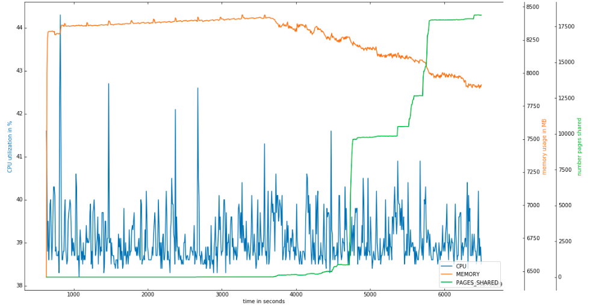

# ksm-benchmark

This repo contains script for collecting KSM metrics in KVM environment

Refer the [paper](ksm_in_kvm.pdf) for more details

CPU utilization, memory usage and number of shared pages plotted for a set with 3 VMs (FreeBSD 12.1, 1GB RAM) with KSM